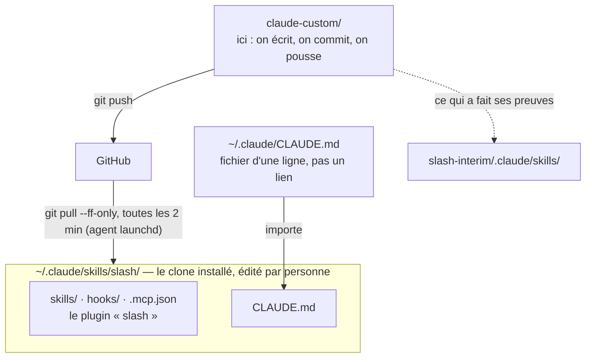
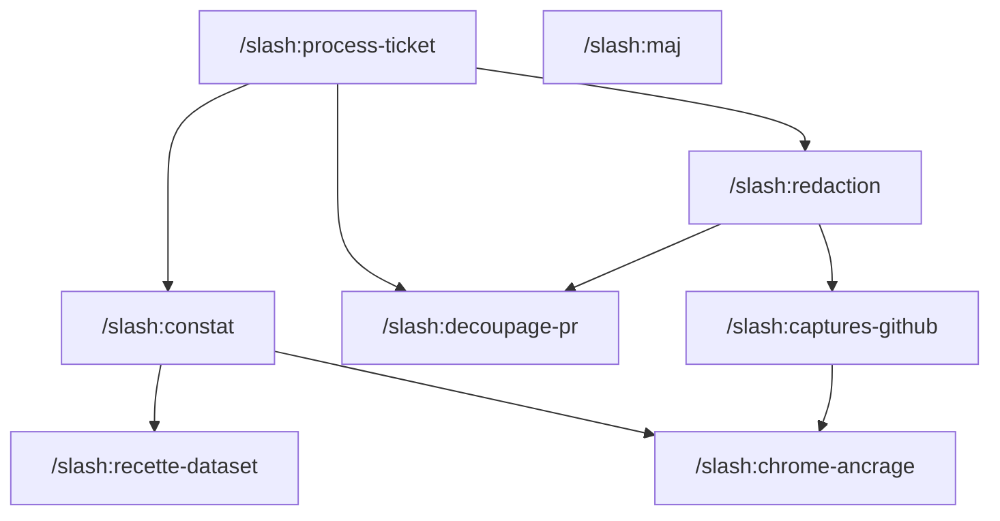

# claude-custom

Mon atelier Claude Code : l'endroit où j'éprouve des skills et des configs avant
de les proposer à l'équipe.

**Un bac à sable, parce qu'un skill ne se juge pas sur le papier.** Il faut le
faire tourner sur de vrais tickets, plusieurs jours, et le corriger à chaud. Tant
qu'il n'est pas stabilisé, il n'a rien à faire dans un dépôt d'équipe : ici je
casse et je reprends sans conséquence pour personne.

**Un chemin vers l'équipe, ensuite.** Ce qui a fait ses preuves est destiné à
migrer vers `slash-interim/.claude/`. C'est pour ça que chaque skill est écrit
pour rester lisible hors de son contexte d'origine, et que les surcharges d'un
skill du dépôt vivent ici en attendant. `skills/decoupage-pr/` en est l'exemple
courant : il surcharge `slash-create-pr` sans y toucher, le temps de vérifier que
ses règles tiennent.

**Tout versionné, d'où le montage.** `~/.claude` mélange la config écrite à la
main et l'état runtime — sessions, historique, `.credentials.json` : le dossier
entier n'est pas versionnable. D'où un dépôt séparé. Et le format **plugin**
plutôt qu'un lien par skill, parce qu'un seul point de montage suffit alors,
hooks et serveur MCP compris.

**Deux dépôts, et non plus un lien symbolique.** Ce que lisent les sessions est un
**clone**, à `~/.claude/skills/slash`, que personne n'édite. On développe ici, on
publie en poussant, et le clone suit tout seul : un agent launchd tire toutes les
deux minutes.

Tant que `~/.claude/skills/slash` était un lien vers ce worktree, le brouillon
*était* la production — chaque sauvegarde partait à l'instant dans toutes les
sessions ouvertes, y compris un skill à moitié réécrit. Et un agent launchd ne
peut pas tirer dans le worktree où l'on est en train d'écrire. Cette séparation
est donc à la fois ce qui rend la mise à jour automatique possible, et ce qui fait
enfin exister une notion de version.



## Les skills

<table>
<thead>
<tr><th>Invocation</th><th>Rôle</th></tr>
</thead>
<tbody>
<tr>
<td nowrap><samp>/slash:constat</samp></td>
<td>Fait constater le problème par la personne qui traite le ticket, plutôt que de lui rapporter un constat — phase didactique avant implémentation, vérification de la résolution après.</td>
</tr>
<tr>
<td nowrap><samp>/slash:decoupage-pr</samp></td>
<td>Garde-fou sur la taille des PR, et mécanique d'ouverture de plusieurs PR pour un ticket — en parallèle ou empilées. Surcharge <code>slash-create-pr</code>.</td>
</tr>
<tr>
<td nowrap><samp>/slash:process-ticket</samp></td>
<td>Parcours complet d'un ticket Linear, du worktree déjà créé jusqu'à la PR ouverte — sept étapes suivies en task list, pour retrouver où on en est en revenant sur un ticket. Orchestre les autres.</td>
</tr>
<tr>
<td nowrap><samp>/slash:recette-dataset</samp></td>
<td>Jeu de données de recette scopé à un ticket SLI, pour constater un bug avant correction puis prouver sa résolution.</td>
</tr>
<tr>
<td nowrap><samp>/slash:redaction</samp></td>
<td>Cadre de rédaction des écrits lus par un humain : descriptions de PR, commentaires de review, messages de commit, et livrables écrits longs — plan, handoff, analyse. Porte la passe d'élagage.</td>
</tr>
<tr>
<td nowrap><samp>/slash:captures-github</samp></td>
<td>Pose des images sur un écrit GitHub — description de PR, commentaire, review. <code>gh</code> ne sait pas uploader, le navigateur le fait et <code>gh</code> garde la main sur le texte.</td>
</tr>
<tr>
<td nowrap><samp>/slash:chrome-ancrage</samp></td>
<td>Règles de pilotage du navigateur quand plusieurs sessions tournent en parallèle.</td>
</tr>
<tr>
<td nowrap><samp>/slash:maj</samp></td>
<td>Le seul qui ne parle pas de tickets : force la mise à jour du clone installé sans attendre le tick de launchd, et depuis ce dépôt-ci plutôt que GitHub avec <code>--depuis-dev</code>, pour éprouver un skill committé sans le pousser.</td>
</tr>
</tbody>
</table>

Qui charge qui — une flèche se lit « charge » :



`process-ticket` orchestre, `chrome-ancrage` et `decoupage-pr` sont des feuilles
chargées par plusieurs — c'est la règle du fait général qui vit dans le skill
général, décrite dans [`docs/contribuer.md`](docs/contribuer.md). `maj` ne touche
à personne. Aucun skill n'appelle `process-ticket` : il n'est qu'un point
d'entrée.

Le nom du plugin sert de **namespace** : c'est pourquoi les dossiers de
`skills/` ne portent plus le préfixe `slash-`, qui ferait doublon. Attention à ne
pas les confondre avec les skills du dépôt slash-interim (`slash-commit`,
`slash-create-pr`), qui gardent le leur.

Taper la commande reste l'exception : un skill part surtout **de lui-même**, sur
sa description. `redaction` et `chrome-ancrage` s'appuient en plus sur une amorce
dans `CLAUDE.md`, parce que leur déclenchement ne peut pas dépendre du hasard.

## Installation

**Prérequis** : macOS, `git`, `python3`, la CLI `claude`, et un accès SSH en
lecture à `vinslash/claude-custom` — c'est de là que le clone installé tirera ses
mises à jour. Le détail, et ce qui est seulement facultatif, est dans
[`docs/installation.md`](docs/installation.md).

```bash
git clone git@github.com:vinslash/claude-custom.git ~/Development/claude-custom
cd ~/Development/claude-custom && ./install.sh
```

Le chemin n'est pas indifférent : `bin/mise-a-jour.sh` code `~/Development/claude-custom`
en dur pour son option `--depuis-dev`. Cloner ailleurs marche, mais `/slash:maj`
ne saura plus tirer d'ici sans passer par GitHub.

L'installateur pose le clone à `~/.claude/skills/slash`, la ligne d'import dans
`~/.claude/CLAUDE.md`, et l'agent launchd qui tire toutes les deux minutes. Il
est idempotent et ne supprime jamais un fichier sans l'avoir sauvegardé.

**Une configuration déjà en place n'est pas écrasée.** L'import est ajouté
*au-dessus* d'un `~/.claude/CLAUDE.md` existant, dont le contenu est conservé ; la
seule entrée touchée dans `settings.json` est la neutralisation d'un serveur MCP
inutilisable sur l'hôte ; et vos skills personnels, vos hooks et vos autres
plugins ne sont pas touchés. Cas par cas dans
[`docs/installation.md`](docs/installation.md).

**Vérifier** : ouvrir une nouvelle session et taper `/slash:`. Dans une session
déjà ouverte, une fois : `/reload-plugins` dans le terminal, ou une nouvelle
session dans l'extension VSCode, qui n'expose pas cette commande.

Qui se servira du navigateur — captures sur une PR, constat dans l'application —
a une étape à faire une fois pour toutes :
`bash ~/.claude/skills/slash/bin/chrome-modele.sh`, pour installer Dashlane et se
connecter à GitHub dans le profil dont chaque worktree clonera le sien.

Le clone installé ne doit **jamais** être édité. Un seul fichier modifié dedans et
le `merge --ff-only` échoue : les mises à jour s'arrêteraient, et en silence.
C'est pour ça que `bin/mise-a-jour.sh` le vérifie à chaque passage et le notifie à
l'écran — c'est la seule panne du montage qu'on ne verrait pas venir.

## La doc

| Fichier | Pour répondre à |
| --- | --- |
| [`docs/installation.md`](docs/installation.md) | Installer chez soi : prérequis, ce qu'il advient d'une config existante, vérifier, désinstaller |
| [`docs/montage.md`](docs/montage.md) | Où vit quoi, et les deux pièges qui ont coûté cher |
| [`docs/propagation.md`](docs/propagation.md) | Quand un changement prend effet — ce qui se recharge à chaud, ce qui exige `/reload-plugins` |
| [`docs/bornes.md`](docs/bornes.md) | Quelle borne s'applique : ce qu'on écrit, la taille d'une PR, les portes anti-overkill |
| [`docs/contribuer.md`](docs/contribuer.md) | Ajouter un skill, vérifier son coût, et tenir cette doc à jour |

## Ne pas versionner ici

`.credentials.json`, `settings.local.json`, et plus généralement tout ce qui porte
un jeton ou une URL interne. Le dépôt est sur GitHub.

`drafts/` est également ignoré : brouillons et handoffs de session, propres à la
machine et sans intérêt pour quelqu'un qui clone.
